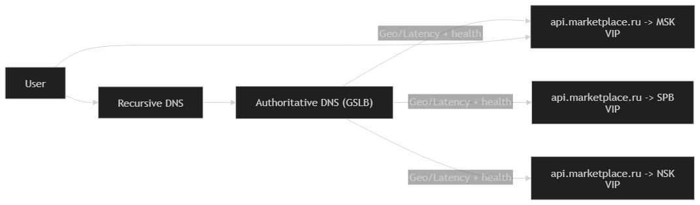

# 3. Глобальная балансировка нагрузки

## 3.1 Функциональное разбиение по доменам

Разделяем публичные точки входа, чтобы независимо масштабировать и маршрутизировать контуры.

| Контур                         | Домен                      | Назначение                                                  |
|--------------------------------|----------------------------|-------------------------------------------------------------|
| Web                            | www.marketplace.ru         | сайт/SPA                                                    |
| Buyer API                      | api.marketplace.ru         | покупательские действия (поиск, карточка, избранное, заказ) |
| Search (опц.)                  | search.marketplace.ru      | поиск/подсказки/фильтры                                     |
| Seller API                     | seller.marketplace.ru      | контент и управление товарами (цены/загрузка)               |
| Media CDN                      | img.marketplace.ru         | выдача картинок                                             |
| Upload init                    | upload.marketplace.ru      | инициация загрузки (получить upload URL, метаданные)        |
| Object storage origin (внутр.) | s3.internal.marketplace.ru | хранение медиа                                              |

## Обоснование расположения ДЦ

Цель геораспределения:
- снижать задержку (особенно критично для поиска и открытия карточки),
- обеспечивать отказоустойчивость на уровне целого ДЦ (active-active + failover),

Выбранные площадки (3 ДЦ):
- MSK (Москва) — основной хаб
- SPB (Санкт-Петербург) — независимый западный резерв
- NSK (Новосибирск) — хаб для восточных регионов (Урал/Сибирь/ДФО)

Влияние на продуктовые метрики:
- меньше RTT - быстрее выдача поиска/карточки, выше вовлечённость и конверсия в заказ.

## Распределение нагрузки по ДЦ

Для расчёта распределения используем статистику по распределению аудитории по федеральным округам РФ.
Источник: https://tass.ru/obschestvo/20338789

Доли трафика:
- MSK: 65.5%
- SPB: 9.5%
- NSK: 25.1%

### Распределение RPS по ДЦ (avg/peak)

| Тип запросов (API)        |     MSK avg/peak |   SPB avg/peak |    NSK avg/peak |
|---------------------------|-----------------:|---------------:|----------------:|
| Search API                | 4924.6 / 12311.6 | 714.3 / 1785.6 | 1887.1 / 4717.9 |
| Product API               |   670.2 / 1675.4 |   97.2 / 243.0 |   256.8 / 642.0 |
| Favorites API             |     60.3 / 150.9 |     8.8 / 21.9 |     23.1 / 57.8 |
| Order API                 |   836.9 / 2092.4 |  121.4 / 303.5 |   320.7 / 801.8 |
| Seller create product API |     45.5 / 113.7 |     6.6 / 16.5 |     17.4 / 43.6 |
| Seller price update API   |    163.8 / 409.4 |    23.8 / 59.4 |    62.8 / 156.9 |
| Seller image upload API   |     91.0 / 227.4 |    13.2 / 33.0 |     34.9 / 87.2 |

## 3.4 DNS-балансировка (GSLB)

Схема: Latency/Geo DNS + health checks + low TTL.
Авторитативный DNS возвращает адрес ближайшего ДЦ для доменов api/search/seller/upload.
Политика:
- Latency-based или Geo-based routing (выдаём ближайший ДЦ)
- Failover: если ДЦ не проходит health-check (ошибки/latency/недоступность зависимостей), исключаем его из ответов
- TTL 30–60 секунд для быстрого переключения

## Anycast-балансировка (BGP Anycast)
Anycast применяем на edge-уровне (точка входа), чтобы пользователь попадал в “ближайшую” площадку автоматически по BGP.
Паттерн: один Anycast VIP анонсируется из нескольких ДЦ, внутри ДЦ трафик распределяется ECMP -> L7 LB -> API Gateway.

## Регулировка трафика между ДЦ

Механизмы управления:
1. DNS-уровень 
- weighted records (веса) для “переливания” части трафика
- исключение ДЦ при деградации (health checks)
- низкий TTL ускоряет восстановление
2. BGP-уровень (Anycast)
- при аварии: withdraw BGP announcement (ДЦ исчезает из маршрутизации)
- при перегрузке: AS-path prepending / BGP communities (делаем ДЦ “менее предпочтительным”)
