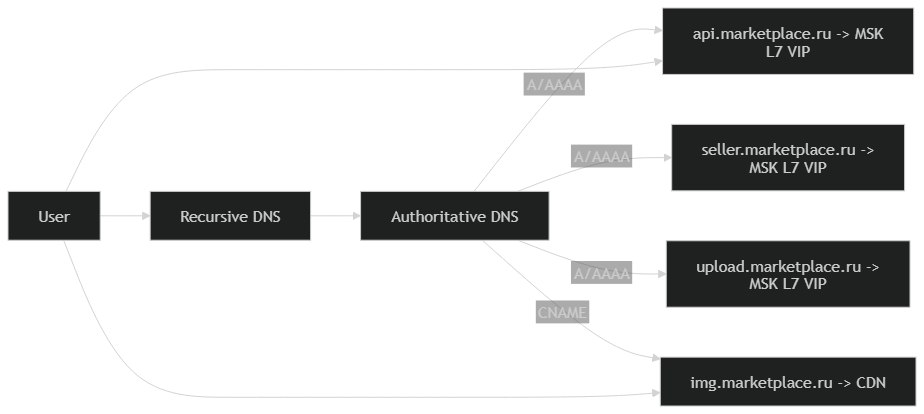

# Глобальная балансировка нагрузки

## Функциональное разбиение по доменам

Разделяем публичные точки входа, чтобы независимо масштабировать и маршрутизировать контуры.

| Контур                | Домен                      | Назначение                                                  |
|-----------------------|----------------------------|-------------------------------------------------------------|
| Web                   | www.marketplace.ru         | сайт/SPA                                                    |
| Buyer API             | api.marketplace.ru         | покупательские действия (поиск, карточка, избранное, заказ) |
| Search                | search.marketplace.ru      | поиск/подсказки/фильтры                                     |
| Seller API            | seller.marketplace.ru      | контент и управление товарами (цены/загрузка)               |
| Media CDN             | img.marketplace.ru         | выдача картинок                                             |
| Upload init           | upload.marketplace.ru      | инициация загрузки (получить upload URL, метаданные)        |
| Object storage origin | s3.internal.marketplace.ru | хранение медиа                                              |

## Расположение ДЦ

Решено использовать один датацентр в Москве (MSK).

Обоснование:
- Основная аудитория находится в западной части РФ (примерно 74%). [[1]](https://tass.ru/obschestvo/20338789)

Компенсации для пользователей восточных регионов:
- раздача изображений и статики через CDN (edge по РФ)
- кэширование выдачи/карточек на edge и в приложении

## DNS-балансировка (GSLB)

Глобальной балансировки между ДЦ нет, поэтому DNS-схема простая:

## Anycast-балансировка (BGP Anycast)

Anycast между датацентрами не используется, так как датацентр один. 
Anycast распределение может применяться на стороне CDN-провайдера для домена img.marketplace.ru

## Регулировка трафика между ДЦ

Регулировка трафика между ДЦ отсутствует, так как датацентр один.

## Источники
1. https://tass.ru/obschestvo/20338789