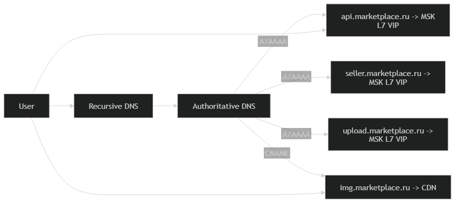
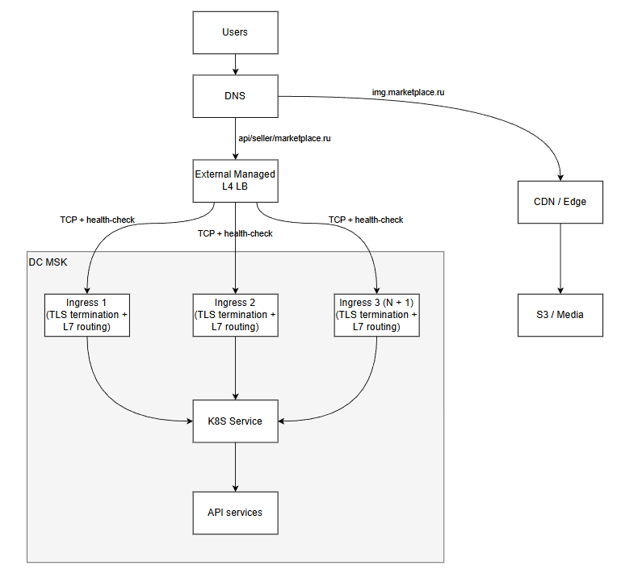
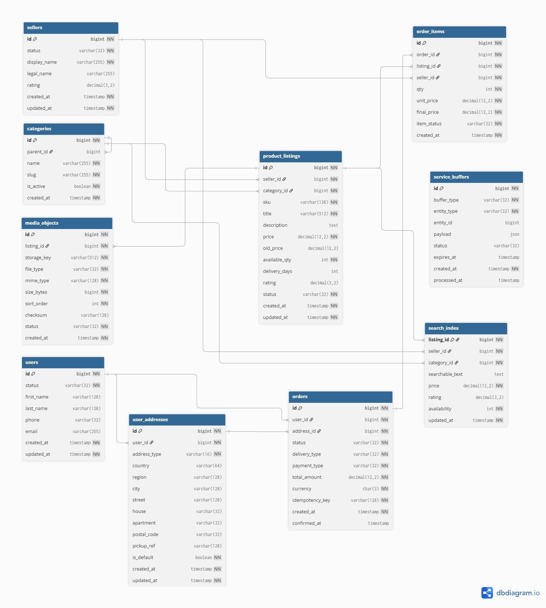
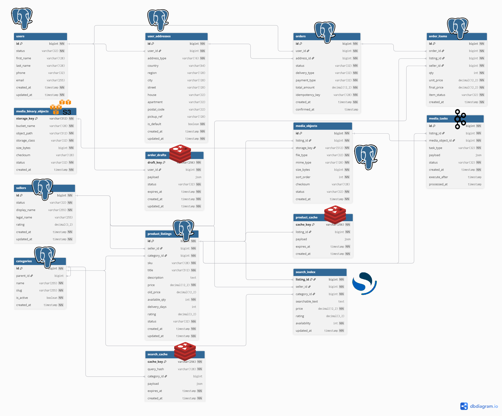

## Маркетплейс (Ozon-подобный сервис)

### Тема проекта
**Маркетплейс** — это онлайн-сервис для продажи и покупки товаров. Продавцы размещают товары, а покупатели заказывают их, выбирая по качеству, скорости доставки и цене.

### Существующие аналоги
- Ozon
- Wildberries
- Яндекс Маркет
- AliExpress
- Amazon

### Целевая аудитория

#### Местоположение аудитории
Россия + страны СНГ.

#### Размер аудитории (ориентир — Ozon)
- **MAU:** 65+ млн [[1]](https://www.retail.ru/news/ozon-stal-liderom-po-mesyachnoy-auditorii-v-rossiyskom-e-commerce-v-iyule/)
- **DAU:** ~9 млн [[2]](https://tass.ru/ekonomika/11649693)

#### Объёмы данных/контента 
- **Ассортимент:** 19+ млн товаров [[2]](https://tass.ru/ekonomika/11649693)
- **Заказы:** 334,8 млн заказов за второй квартал 2024 [[3]](https://cdn.financemarker.ru/reports/2024/MOEX/O/OZON_2024_6_6M_%D0%9C%D0%A1%D0%A4%D0%9E_press.pdf)

### Функциональные требования (MVP)

#### Ключевой функционал 
1. **Поиск товаров**: строка поиска + автодополнение/подсказки, выдача с фильтрами и сортировками (цена, доставка/ПВЗ, наличие, рейтинг).
2. **Каталог и навигация**: категории + подборки/лента, переход в выдачу категории, те же фильтры/сортировки.
3. **Карточка товара**: описание, характеристики, фото, список предложений продавцов (цена/доставка/наличие), выбор предложения.
4. **Оформление заказа**: корзина/состав заказа, выбор доставки/ПВЗ, подтверждение и фиксация итоговой цены.
5. **Профиль покупателя**: авторизация, контакты и адреса доставки/ПВЗ.

### Ключевые продуктовые решения 

- **Модель “много товаров - много продавцов”**: одинаковые товары не объединяются в единую карточку.

### Список источников
1) https://www.retail.ru/news/ozon-stal-liderom-po-mesyachnoy-auditorii-v-rossiyskom-e-commerce-v-iyule/  
2) https://tass.ru/ekonomika/11649693  
3) https://cdn.financemarker.ru/reports/2024/MOEX/O/OZON_2024_6_6M_%D0%9C%D0%A1%D0%A4%D0%9E_press.pdf  

# Расчёт нагрузки

## Продуктовые метрики

### Сводная таблица

| MAU, млн | DAU, млн | СРХ, шт |   СРХ, ГБ    | СКД, действий/день |
|:--------:|:--------:|:-------:|:------------:|:------------------:|
|  62,83   |  24,72   |   380   | 1,03 * 10^-4 |    2,44 / 47,67    |

**Расшифровка:**
- **MAU** — месячная аудитория.
- **DAU** — дневная аудитория.
- **СРХ** — средний размер хранилища на пользователя.
- **СКД** — среднее число продуктовых действий пользователя.


### Расчёт MAU, DAU

В источнике [[1]](https://mediascope.net/upload/iblock/9da/f39jd547adzptf0mu2j1tlmw44pjgt5d/Mediascope_НРФ_6%20суток.pdf) 
дана месячная аудитория интернета в РФ и процент пользователей OZON, отсюда считаем MAU:

MAU = 103 * 0.61 = 62,83 млн

Также в источнике указан и дневной охват аудитории:

DAU = 103 * 0.24 = 24,72 млн

### Средний размер хранилища пользователя (СРХ)

В MVP маркетплейса для пользователя существенно хранить:
1. **Избранное** 
2. **История заказов** за период хранения (например, 3 года)
3. **Профиль/адреса/контакты**

Среднее число заказов на пользователя в год из источника [[2]](https://ir.ozon.com/en/sth/ozon-reports-second-quarter-2025-financial-results-and-raises-full-year-outlook-c397b9ca) 
равно 30, количество товаров в заказе 3. [[3]](https://datainsight.ru/sites/default/files/DI_b2c_online-import_2024_short_version.pdf)
Тогда, считая что заказ состоит из шапки и самих товаров, выходит (1 + 3) * 30 * 3 = 360.
Среднее число избранных товаров на пользователя не указано в открытых источниках, однако опираясь на данные [[4]](https://www.retail.ru/news/ozon-i-wildberries-stali-glavnymi-ploshchadkami-dlya-shopinga-u-86-rossiyan-8-sentyabrya-2025-268799) 
о том, что 54% пользователей добавляют товар в избранное перед тем как купить, будем считать это число равным 16. 
Профиль и контакты будем считать по 1, а адреса 2 (дом + ПВЗ).
Отсюда:

СРХ = favorites + orders_headers + order_items + profile + contacts + addresses = 360 + 16 + 1 + 1 + 2 = 380 шт

Приняв следующие размеры записей:

- favorite_record_size = 32 б
- order_header_size = 1024 б
- order_item_size = 64 б
- profile_size = 512 б
- contact_size = 128 б
- address_size = 256 б

Получаем:

СРХ = (16 * 32 +  90 * 1024 + 270 * 64 + 512 + 128 + 2 * 256) = 108,5 Кб = 1,03 * 10^-4 Гб

### Среднее количество действий пользователя (СКД)

Данные рассчитаны именно для **активных** покупателей (20.1 млн в день). [[5]](https://cdn.financemarker.ru/reports/2024/MOEX/O/OZON_2024_6_6M_МСФО_press.pdf)

| Действие (покупатель)                                                                                                                                                    | Среднее кол-во в день  |
|--------------------------------------------------------------------------------------------------------------------------------------------------------------------------|:----------------------:|
| Поисковые запросы [[6]](https://sberbusiness.live/publications/kak-pokupateli-ischut-tovar-na-marketpleisah-issledovanie-mediascope)                                     |          1,62          |
| Просмотры карточек товара [[7]](https://elama.ru/info/uploads/blog_elama/2025/12/katya/daydzhest_target/reklama_na_mp/ozon_media_kit.pdf)                                |          0,44          |
| Добавление/удаление из избранного [[4]](https://www.retail.ru/news/ozon-i-wildberries-stali-glavnymi-ploshchadkami-dlya-shopinga-u-86-rossiyan-8-sentyabrya-2025-268799) |          0,2           |
| Создание заказа [[7]](https://elama.ru/info/uploads/blog_elama/2025/12/katya/daydzhest_target/reklama_na_mp/ozon_media_kit.pdf)                                          |          0,18          |

| Действие (продавец)                                                                                   | Среднее кол-во в день  |
|-------------------------------------------------------------------------------------------------------|:----------------------:|
| Загрузка новых товаров [[8]](https://t.me/s/ozonhq)                                                   |          1,67          |
| Обновления цены [[8]](https://t.me/s/ozonhq)                                                          |           36           |
| Загрузка изображений [[9]](https://seller-edu.ozon.ru/work-with-goods/reference-goods/content-rating) |           10           |


## Технические метрики

### Размер хранения (разбивка по типам данных)

- MAU = 62,83 млн
- N_buyers = 51,1 млн (активные покупатели)
- N_sellers = 600 000 (активные продавцы)
- N_products = 200 000 000 (товарных наименований)

История:
- orders_per_year = 30
- years_to_keep_orders = 3
- items_per_order = 3

Пользовательские данные:
- favorites_per_user = 16
- addresses_per_user = 2

Средние размеры записей:
- favorite_record_size = 32 B
- order_header_size = 1024 B
- order_item_size = 64 B
- profile_size = 512 B
- contact_size = 128 B
- address_size = 256 B
- product_record_size = 2048 B (карточка без медиа)
- seller_record_size = 1024 B

Медиа:
- avg_images_per_product = 6
- avg_image_size = 300 KB

Search index:
- index_bytes_per_product = 6 KB (документ + служебный overhead)


| Блок данных  | Сущность                |   Кол-во (шт) | Размер записи | Объём, TB |
|--------------|-------------------------|--------------:|--------------:|----------:|
| Пользователь | Profile                 |  63,83 * 10^6 |         512 B |   0,03268 |
| Пользователь | Contact                 |  63,83 * 10^6 |         128 B |   0,00817 |
| Пользователь | Address                 | 127,66 * 10^6 |         256 B |   0,03268 |
| Пользователь | Favorite                |  1,021 * 10^9 |          32 B |   0,03268 |
| Заказы       | OrderHeader             |    4,6 * 10^9 |        1024 B |    4,7104 |
| Заказы       | OrderItem               |   13,8 * 10^9 |          64 B |    0,8832 |
| Каталог      | ProductListing          |    200 * 10^6 |        2048 B |    0,4096 |
| Продавцы     | Seller                  |       600 000 |        1024 B |   0,00061 |
| Поиск        | Search index            |    200 * 10^6 |          6 KB |    0,0012 |
| Медиа        | Images (object storage) |    1,2 * 10^9 |        300 KB |      0,36 |


### RPS по типам запросов (avg/peak) [[10]]

Дневные объёмы:
- Search/day = 32,48 млн
- Product views/day = 8,84 млн
- Favorites actions/day = 3,98 млн
- Orders created/day = 3,68 млн

- New products/day = 1.0 млн
- Price updates/day = 21,6 млн
- Image uploads/day = 6,0 млн

Перевод в RPS:
- Requests/day = Actions/day × Calls/action
- RPS_avg = Requests/day / 86400
- RPS_peak = RPS_avg × k_peak, где k_peak = 2.5

| Тип запроса (API)      |  Actions/day | Calls/action | RPS avg | RPS peak |
|------------------------|-------------:|-------------:|--------:|---------:|
| Поиск                  | 32,48 * 10^6 |           20 | 7518,52 | 18796,30 |
| Просмотр товара        |  8,84 * 10^6 |           10 | 1023,15 |  2557,87 |
| Избранное (add/remove) |  3,98 * 10^6 |            2 |   92,13 |   230,32 |
| Создание заказа        |  3,68 * 10^6 |           30 | 1277,78 |  3194,44 |
| Seller: создать товар  |  1,00 * 10^6 |            6 |   69,44 |   173,61 |
| Seller: обновить цену  | 21,60 * 10^6 |            1 |  250,00 |   625,00 |
| Seller: загрузить фото |  6,00 * 10^6 |            2 |  138,89 |   347,22 |

### Сетевой трафик

Для трафика задаём средний размер “события” (request+response):
- search_api = 260 KB
- product_view_api = 358 KB
- favorite_api = 1 KB
- order_api = 10 KB
- seller_new_product_api = 10 KB
- seller_price_update_api = 1 KB
- seller_image_upload = 301 KB (данные фото + оверхед)

CDN (картинки):
- thumbnails: 20 шт на 1 поиск, 25 KB каждая
- product images: 5 шт на 1 просмотр товара, 250 KB каждая

Формулы:
- Avg_Gbps = (count_per_day * bytes_per_event * 8) / 86400 / 10^9
- GB_per_day = (count_per_day * bytes_per_event) / 10^9
- Peak_Gbps = Avg_Gbps * k_peak (k_peak = 2.5)

| Тип трафика                    | Events/day | Avg bytes/event |          Avg | Peak (k=2.5) |   Volume/day |
|--------------------------------|-----------:|----------------:|-------------:|-------------:|-------------:|
| API: Search                    |     32,48M |           260KB | 0.801 Gbit/s | 2.002 Gbit/s |  8.44 TB/day |
| API: Product view              |      8,84M |           358KB |   0.3 Gbit/s |  0.75 Gbit/s |  3.16 TB/day |
| API: Favorites                 |      3,98M |             1KB |    0.38 Mb/s |    0.94 Mb/s |  4.08 GB/day |
| API: Order create              |      3,68M |            10KB |    3.49 Mb/s |    8.72 Mb/s | 37.68 GB/day |
| API: Seller create product     |      1,00M |            10KB |    0.95 Mb/s |    2.37 Mb/s | 10.24 GB/day |
| API: Seller price update       |     21,60M |             1KB |    2.05 Mb/s |    5.12 Mb/s | 22.12 GB/day |
| Upload: Seller image (ingress) |      6,00M |           301KB | 0.171 Gbit/s | 0.428 Gbit/s |  1.81 TB/day |
| CDN: Thumbnails in search      |     32,48M |           500KB | 1.540 Gbit/s | 3.849 Gbit/s | 16.24 TB/day |
| CDN: Product images in PDP     |      8,84M |          1.22MB | 1.048 Gbit/s | 2.619 Gbit/s | 11.05 TB/day |

## Источники
1. https://mediascope.net/upload/iblock/9da/f39jd547adzptf0mu2j1tlmw44pjgt5d/Mediascope_НРФ_6%20суток.pdf
2. https://ir.ozon.com/en/sth/ozon-reports-second-quarter-2025-financial-results-and-raises-full-year-outlook-c397b9ca
3. https://datainsight.ru/sites/default/files/DI_b2c_online-import_2024_short_version.pdf
4. https://www.retail.ru/news/ozon-i-wildberries-stali-glavnymi-ploshchadkami-dlya-shopinga-u-86-rossiyan-8-sentyabrya-2025-268799
5. https://cdn.financemarker.ru/reports/2024/MOEX/O/OZON_2024_6_6M_МСФО_press.pdf
6. https://sberbusiness.live/publications/kak-pokupateli-ischut-tovar-na-marketpleisah-issledovanie-mediascope
7. https://elama.ru/info/uploads/blog_elama/2025/12/katya/daydzhest_target/reklama_na_mp/ozon_media_kit.pdf
8. https://t.me/s/ozonhq
9. https://seller-edu.ozon.ru/work-with-goods/reference-goods/content-rating
10. https://habr.com/ru/companies/ozontech/articles/749328/

# Глобальная балансировка нагрузки

## Функциональное разбиение по доменам

Разделяем публичные точки входа, чтобы независимо масштабировать и маршрутизировать контуры.

| Контур                | Домен                      | Назначение                                                  |
|-----------------------|----------------------------|-------------------------------------------------------------|
| Web                   | www.marketplace.ru         | сайт/SPA                                                    |
| Buyer API             | api.marketplace.ru         | покупательские действия (поиск, карточка, избранное, заказ) |
| Seller API            | seller.marketplace.ru      | контент и управление товарами (цены/загрузка)               |
| Media CDN             | img.marketplace.ru         | выдача картинок                                             |

## Расположение ДЦ

Решено использовать один датацентр в Москве (MSK).

Обоснование:
- Основная аудитория находится в западной части РФ (примерно 74%). [[1]](https://tass.ru/obschestvo/20338789)

Компенсации для пользователей восточных регионов:
- раздача изображений и статики через CDN (edge по РФ)
- кэширование выдачи/карточек на edge и в приложении

## DNS-балансировка (GSLB)

Глобальной балансировки между ДЦ нет, поэтому DNS-схема простая:



## Источники
1. https://tass.ru/obschestvo/20338789

## Локальная балансировка нагрузки

### Схема
Вход в ДЦ осуществляется через внешний управляемый L4-балансировщик (провайдер). Он предоставляет стабильную точку входа и выполняет L4 балансировку TCP на пул L7-балансировщиков внутри ДЦ. L7-балансировщики (NGINX Ingress) выполняют SSL termination и L7 routing в Kubernetes-кластер.



Через контур локальной балансировки ДЦ проходит трафик доменов:
- `api/*` (поиск, просмотр карточки, заказы)
- `upload/*` (загрузка изображений продавцом)

Отдача пользовательских изображений и миниатюр выполняется через CDN и не является лимитатором L7-балансировщиков внутри ДЦ.

### Резервирование
**L4 (внешний, провайдерский)** [[2]](https://docs.selectel.ru/en/load-balancer/about/about-load-balancer/)
- Отказоустойчивость точки входа и L4-балансировки обеспечивается провайдером.
- L4 выполняет health-check L7-пула и исключает недоступные L7 из балансировки.

**L7 (ingress + SSL termination)**
- L7-балансировщики развёрнуты в количестве, достаточном для выдерживания пиковой нагрузки и отказа одного узла.
- Используется схема резервирования **N+1**.

### Расчёт количества L7-балансировщиков

#### Входные данные (пик)
- `RPS_peak_total = 25 925 RPS`
- Пиковый сетевой трафик через ingress (API+upload, без CDN): `BW_peak_ingress ≈ 3.20 Gbit/s`

#### 1) Ограничитель SSL termination
Приняты параметры:
- доля новых TLS-соединений в пике: `k_new = 0.25`
- целевая загрузка узла: `u = 0.5` [[2]](https://kubernetes.io/docs/concepts/workloads/autoscaling/horizontal-pod-autoscale/)
- профиль узла L7: 16 vCPU [[3]](https://blog.nginx.org/blog/testing-the-performance-of-nginx-and-nginx-plus-web-servers)
- производительность NGINX для HTTPS: `CPS_node ≈ 6 676 CPS` [[3]](https://blog.nginx.org/blog/testing-the-performance-of-nginx-and-nginx-plus-web-servers)

Расчёт:
`TLS_CPS_req = RPS_peak_total * k_new = 6 481 CPS`  
`CPS_eff = CPS_node * u = 3 338 CPS`  
`N_ssl = ceil(TLS_CPS_req / CPS_eff) = 2`  
С резервированием N+1:
`N_l7_total = N_ssl + 1 = 3`

#### 2) Ограничитель сети
Приняты параметры:
- NIC узла L7: `10 Gbit/s` [[3]](https://blog.nginx.org/blog/testing-performance-nginx-ingress-controller-kubernetes )
- безопасная загрузка: `0.7`

Расчёт:
`BW_eff_node = 10 * 0.7 = 7 Gbit/s`  
`N_net = ceil(BW_peak_ingress / BW_eff_node)= 1`  
С резервированием N+1:
`N_net_total = N_net + 1 = 2`

#### Итог
- по SSL: `3` узла
- по сети: `2` узла
Итого: **L7 (Ingress + SSL termination) = 3 узла (N+1)**.


1. https://docs.selectel.ru/en/load-balancer/about/about-load-balancer/
2. https://kubernetes.io/docs/concepts/workloads/autoscaling/horizontal-pod-autoscale/
3. https://blog.nginx.org/blog/testing-the-performance-of-nginx-and-nginx-plus-web-servers
4. https://blog.nginx.org/blog/testing-performance-nginx-ingress-controller-kubernetes

## Логическая схема БД

В разделе используется **упрощённая логическая схема БД**, в которой оставлены основные бизнес-сущности и ключевые технические контуры системы.

### Логическая схема



Принята модель **«много товаров — много продавцов»**, поэтому базовой сущностью каталога является `product_listings` — конкретное предложение продавца со своей ценой, остатком, рейтингом и сроком доставки.

### Описание таблиц

| Таблица            | Назначение                                      | Особенности                                              |
|--------------------|-------------------------------------------------|----------------------------------------------------------|
| `users`            | Пользователи и их контактные данные             | содержит профиль покупателя, телефон и email             |
| `user_addresses`   | Адреса доставки пользователя                    | хранит домашние адреса/пвз и данные для получения заказа |
| `sellers`          | Продавцы                                        | карточка продавца и его статус                           |
| `categories`       | Категории каталога                              | иерархический справочник                                 |
| `product_listings` | Карточки товарных предложений продавцов         | основная сущность каталога                               |
| `media_objects`    | Изображения и файловые объекты карточек товаров | хранит ключ объекта, тип, размер и порядок показа        |
| `orders`           | Заказы                                          | шапка заказа с пользователем, адресом, суммой и статусом |
| `order_items`      | Позиции заказа                                  | отдельные товары внутри заказа                           |
| `search_index`     | Поисковая read-model                            | денормализованное представление каталога для поиска      |
| `service_buffers`  | Кэши, очереди и служебные буферы                | хранит временные технические данные                      |

### Размеры данных и нагрузки

Ниже приведены укрупнённые оценки размеров и QPS.  
Для таблиц, которые объединяют несколько сущностей, показатели также указаны в агрегированном виде.

| Таблица            | Средний размер строки |     Оценка объёма | Запись, peak QPS |          Чтение, peak QPS |
|--------------------|----------------------:|------------------:|-----------------:|--------------------------:|
| `users`            |                 640 B |          40,85 GB |               25 |                      3194 |
| `user_addresses`   |                 256 B |          32,68 GB |               25 |                      3194 |
| `sellers`          |                  1 KB |           0,61 GB |                5 |                      2558 |
| `categories`       |                 128 B |              1 MB |                1 |                      2500 |
| `product_listings` |                  2 KB |          409,6 GB |              799 |                      2558 |
| `media_objects`    |                300 KB |         368,64 TB |              347 | основное чтение через CDN |
| `orders`           |                  1 KB |           4,71 TB |             3194 |                      1250 |
| `order_items`      |                  64 B |          883,2 GB |             9583 |                      3750 |
| `search_index`     |                  6 KB |         1,2288 TB |              799 |                     18796 |
| `service_buffers`  |                  8 KB | 50 GB working set |             4571 |                     21354 |

### Требования к консистентности

| Таблица                 | Консистентность                       | Обоснование                                            |
|-------------------------|---------------------------------------|--------------------------------------------------------|
| `users`                 | strong                                | данные пользователя должны быть актуальны при checkout |
| `user_addresses`        | strong                                | заказ нельзя оформлять по несогласованному адресу      |
| `product_listings`      | strong в checkout, eventual в витрине | цена и остаток должны быть точными в момент заказа     |
| `orders`                | strong                                | заказ должен фиксироваться целиком                     |
| `order_items`           | strong                                | состав заказа должен быть согласован с шапкой          |
| `search_index`          | eventual                              | поисковая выдача может кратковременно отставать        |
| `media_objects`         | eventual                              | производные изображения могут появляться с задержкой   |
| `service_buffers`       | eventual / at-least-once              | кэши и очереди не требуют строгой синхронности         |
| `categories`, `sellers` | eventual                              | меняются редко                                         |

### Особенности распределения нагрузки по ключам

| Таблица            | Ключ распределения                        | Характер нагрузки                                              |
|--------------------|-------------------------------------------|----------------------------------------------------------------|
| `users`            | `id`                                      | относительно равномерная user-centric нагрузка                 |
| `user_addresses`   | `user_id`                                 | user-centric нагрузка                                          |
| `sellers`          | `id`                                      | сравнительно равномерная, но есть крупные продавцы             |
| `categories`       | `id`, `parent_id`                         | read-heavy справочник                                          |
| `product_listings` | `id`, `seller_id`, `category_id`          | есть перекос по популярным карточкам                           |
| `media_objects`    | `listing_id`, `storage_key`               | запись равномерная, чтение смещено в популярные карточки       |
| `orders`           | `id`, `user_id`                           | всплески по времени: вечер, акции, распродажи                  |
| `order_items`      | `order_id`, `listing_id`                  | зависит от потока заказов                                      |
| `search_index`     | `listing_id`, поисковые ключи             | самая тяжёлая read-нагрузка                                    |
| `service_buffers`  | `buffer_type`, `entity_type`, `entity_id` | сильная неравномерность по горячим запросам и активным сессиям |

## Физическая схема БД

### Привязка логической схемы к физическим хранилищам



Привязка к физическим хранилищам следующая:

- `users`, `user_addresses` — PostgreSQL (`profile_db`);
- `sellers`, `categories`, `product_listings`, `media_objects` — PostgreSQL (`catalog_db`);
- `media_binary_objects` — MinIO;
- `orders`, `order_items` — PostgreSQL (`order_db`);
- `search_index` — OpenSearch;
- `search_cache`, `product_cache`, `order_drafts` — Redis Cluster;
- `media_tasks` — Kafka.

### Сводная таблица физической схемы

| Сущность               | Тип                        | Формат хранения                               | Технология / размещение        | Шардирование                | Срок хранения                                                                    | Описание                                  |
|------------------------|----------------------------|-----------------------------------------------|--------------------------------|-----------------------------|----------------------------------------------------------------------------------|-------------------------------------------|
| `users`                | основная таблица           | строковое транзакционное хранение             | PostgreSQL `profile_db`, SSD   | нет                         | весь срок жизни аккаунта + 180 дней после удаления                               | профиль пользователя, контакты, статус    |
| `user_addresses`       | основная таблица           | строковое транзакционное хранение             | PostgreSQL `profile_db`, SSD   | нет                         | пока адрес активен + 180 дней после удаления                                     | адреса доставки и ПВЗ                     |
| `sellers`              | основная таблица           | строковое транзакционное хранение             | PostgreSQL `catalog_db`, SSD   | нет                         | весь срок жизни продавца + 180 дней после удаления                               | карточка продавца и статус                |
| `categories`           | справочник                 | строковое транзакционное хранение             | PostgreSQL `catalog_db`, SSD   | нет                         | постоянно до административного изменения                                         | дерево категорий                          |
| `product_listings`     | основная таблица           | строковое транзакционное хранение             | PostgreSQL `catalog_db`, SSD   | по `listing_id`             | пока карточка активна + 180 дней после архивирования                             | карточка предложения продавца             |
| `media_objects`        | таблица метаданных         | строковое транзакционное хранение             | PostgreSQL `catalog_db`, SSD   | по `listing_id`             | пока карточка активна + 180 дней после архивирования                             | ключ объекта, тип, размер, порядок показа |
| `media_binary_objects` | файловые данные            | объектное хранение                            | MinIO, HDD                     | нет на уровне приложения    | пока карточка активна + 180 дней после архивирования                             | оригиналы и производные изображения       |
| `orders`               | основная таблица           | строковое транзакционное хранение             | PostgreSQL `order_db`, SSD     | по `user_id`                | 3 года                                                                           | шапка заказа                              |
| `order_items`          | основная таблица           | строковое транзакционное хранение             | PostgreSQL `order_db`, SSD     | в том же шарде, что и заказ | 3 года                                                                           | позиции заказа                            |
| `search_index`         | поисковая read-model       | документное хранение + инвертированный индекс | OpenSearch, NVMe               | по `listing_id`             | пока карточка активна; удаление из индекса не позднее 24 часов после деактивации | поиск, фильтры, сортировки                |
| `search_cache`         | кэширующий слой            | key-value / json                              | Redis Cluster, RAM             | по ключу                    | 1 минута                                                                         | кэш поисковой выдачи                      |
| `product_cache`        | кэширующий слой            | key-value / json                              | Redis Cluster, RAM             | по `listing_id`             | 5 минут                                                                          | кэш карточки товара                       |
| `order_drafts`         | кэширующий / буферный слой | key-value / json                              | Redis Cluster, RAM             | по `user_id`                | 30 дней                                                                          | корзина и черновик оформления заказа      |
| `media_tasks`          | буферный слой              | журнал сообщений / task payload               | Kafka, локальный диск брокеров | по `listing_id`             | 3 дня                                                                            | очередь задач обработки изображений       |

### Индексы

Используются только минимально необходимые индексы: первичные ключи, ограничения уникальности и индексы под основные сценарии чтения. Полнотекстовый поиск и сложная фильтрация не обслуживаются индексами PostgreSQL и вынесены в `search_index` в OpenSearch.

| Сущность               | Индекс / структура                                                                                                            | Тип                         | Unique | Описание                                      |
|------------------------|-------------------------------------------------------------------------------------------------------------------------------|-----------------------------|--------|-----------------------------------------------|
| `users`                | `pk_users(id)`                                                                                                                | B-tree                      | да     | основной доступ по пользователю               |
| `users`                | `ux_users_email(email)`                                                                                                       | B-tree                      | да     | поиск и контроль уникальности email           |
| `users`                | `ux_users_phone(phone)`                                                                                                       | B-tree                      | да     | поиск и контроль уникальности телефона        |
| `user_addresses`       | `pk_user_addresses(id)`                                                                                                       | B-tree                      | да     | точечное чтение адреса                        |
| `user_addresses`       | `idx_user_addresses_user_id(user_id)`                                                                                         | B-tree                      | нет    | список адресов пользователя                   |
| `sellers`              | `pk_sellers(id)`                                                                                                              | B-tree                      | да     | точечное чтение продавца                      |
| `categories`           | `pk_categories(id)`                                                                                                           | B-tree                      | да     | точечное чтение категории                     |
| `categories`           | `idx_categories_parent_id(parent_id)`                                                                                         | B-tree                      | нет    | построение дерева категорий                   |
| `categories`           | `ux_categories_slug(slug)`                                                                                                    | B-tree                      | да     | доступ по slug                                |
| `product_listings`     | `pk_product_listings(id)`                                                                                                     | B-tree                      | да     | основной доступ к карточке                    |
| `product_listings`     | `idx_product_listings_seller_id(seller_id)`                                                                                   | B-tree                      | нет    | список товаров продавца                       |
| `product_listings`     | `idx_product_listings_category_status_price(category_id, status, price)`                                                      | B-tree                      | нет    | выборки каталога по категории, статусу и цене |
| `media_objects`        | `pk_media_objects(id)`                                                                                                        | B-tree                      | да     | точечное чтение метаданных                    |
| `media_objects`        | `ux_media_objects_storage_key(storage_key)`                                                                                   | B-tree                      | да     | уникальность объекта в файловом хранилище     |
| `media_objects`        | `idx_media_objects_listing_sort(listing_id, sort_order)`                                                                      | B-tree                      | нет    | выдача изображений карточки в нужном порядке  |
| `media_binary_objects` | `pk_media_binary_objects(storage_key)`                                                                                        | B-tree                      | да     | основной доступ к бинарному объекту           |
| `orders`               | `pk_orders(id)`                                                                                                               | B-tree                      | да     | основной доступ к заказу                      |
| `orders`               | `ux_orders_idempotency_key(idempotency_key)`                                                                                  | B-tree                      | да     | защита от повторного создания заказа          |
| `orders`               | `idx_orders_user_created(user_id, created_at desc)`                                                                           | B-tree                      | нет    | история заказов пользователя                  |
| `order_items`          | `pk_order_items(id)`                                                                                                          | B-tree                      | да     | точечное чтение позиции                       |
| `order_items`          | `idx_order_items_order_id(order_id)`                                                                                          | B-tree                      | нет    | состав заказа                                 |
| `search_index`         | полнотекстовый индекс по `searchable_text` и индексируемые поля `seller_id`, `category_id`, `price`, `rating`, `availability` | inverted index / doc values | нет    | поиск, фильтры, сортировки и агрегации        |

Для `search_cache`, `product_cache`, `order_drafts` и `media_tasks` отдельные SQL-индексы не выделяются, так как это технические сущности Redis Cluster и Kafka, где используются ключи доступа, TTL и partition key.

### Денормализация

| Сущность           | Денормализованные поля / проекция                                                | Описание                                                                                           |
|--------------------|----------------------------------------------------------------------------------|----------------------------------------------------------------------------------------------------|
| `product_listings` | `available_qty`, `delivery_days`, `rating`                                       | часто используемые поля хранятся прямо в карточке товара для чтения без дополнительных объединений |
| `order_items`      | `seller_id`, `unit_price`, `final_price`                                         | значения фиксируются в момент оформления заказа и далее не зависят от изменений карточки           |
| `search_index`     | `seller_id`, `category_id`, `searchable_text`, `price`, `rating`, `availability` | отдельная поисковая проекция, собранная из основных сущностей каталога                             |

Новые таблицы для денормализации не вводятся.

### Кэши и буферы

#### Кэши

| Кэш             | Технология | Где используется  | Политика                         | Описание                             | Оценка объёма                                                                                              | Целевой cache hit |
|-----------------|------------|-------------------|----------------------------------|--------------------------------------|------------------------------------------------------------------------------------------------------------|-------------------|
| `search_cache`  | Redis      | поиск             | 1 минута                         | кэш горячих поисковых запросов       | рассчитывается как число уникальных горячих поисковых запросов в минуту × средний размер результата в кэше | 70–80%            |
| `product_cache` | Redis      | просмотр карточки | 5 минут, удаление при обновлении | кэш готовой карточки товара          | рассчитывается как число одновременно горячих карточек × средний размер одной карточки в кэше              | 85–95%            |
| `order_drafts`  | Redis      | корзина, checkout | 30 дней                          | корзина и черновик оформления заказа | рассчитывается как число активных корзин × средний размер одного черновика заказа                          | 60–80%            |

#### Буферы

| Буфер         | Технология | Продюсер  | Потребитель                  | Описание                                            |
|---------------|------------|-----------|------------------------------|-----------------------------------------------------|
| `media_tasks` | Kafka      | Media API | worker обработки изображений | генерация `preview` / `thumbnail` и удаление файлов |

Отдельные буферы для обновления `search_index` на схеме не выделяются.

### Шардирование и резервирование СУБД

| Сущность / контур                                               | Тип распределения                     | Ключ / правило                                                | Как работает                                                                                                         | Резервирование                                           |
|-----------------------------------------------------------------|---------------------------------------|---------------------------------------------------------------|----------------------------------------------------------------------------------------------------------------------|----------------------------------------------------------|
| `profile_db` (`users`, `user_addresses`)                        | без шардирования                      | —                                                             | единый PostgreSQL-контур                                                                                             | один основной узел и две реплики для чтения              |
| `catalog_db` (`sellers`, `categories`)                          | без шардирования                      | —                                                             | единый PostgreSQL-контур                                                                                             | один основной узел и одна реплика                        |
| `catalog_db` (`product_listings`, `media_objects`)              | горизонтальное шардирование           | `hash(listing_id)`                                            | сервис по `listing_id` выбирает нужный шард; запись идёт в основной узел шарда, чтение — в основной узел или реплику | 8 шардов, для каждого один основной узел и одна реплика  |
| `order_db` (`orders`, `order_items`)                            | горизонтальное шардирование           | `hash(user_id)`; `order_items` — в шарде родительского заказа | история заказов пользователя локализуется в одном шарде                                                              | 16 шардов, для каждого один основной узел и одна реплика |
| `search_index`                                                  | индексное шардирование                | `listing_id`                                                  | OpenSearch сам распределяет документы по shard индекса                                                               | 12 основных shard и по одной копии для каждого           |
| Redis Cluster (`search_cache`, `product_cache`, `order_drafts`) | cluster sharding                      | ключ Redis                                                    | Redis Cluster сам распределяет ключи по слотам                                                                       | для каждого master есть replica                          |
| Kafka (`media_tasks`)                                           | partitioning                          | `listing_id`                                                  | Kafka распределяет сообщения по разделам; порядок сохраняется внутри ключа                                           | каждая запись хранится на трёх брокерах                  |
| объектное хранилище (`media_binary_objects`)                    | без шардирования на уровне приложения | —                                                             | приложению доступен единый bucket; внутреннее распределение делает само хранилище                                    | три копии объекта на разных storage-нодах                |

### Клиентские библиотеки / интеграции

| Компонент  | Интеграция                          | Назначение                     |
|------------|-------------------------------------|--------------------------------|
| PostgreSQL | драйвер PostgreSQL + пул соединений | транзакции и OLTP-запросы      |
| OpenSearch | HTTP / REST client                  | индексация и поисковые запросы |
| Redis      | cluster-aware Redis client          | кэши и корзина                 |
| Kafka      | producer / consumer client          | очереди и асинхронные буферы   |
| MinIO      | S3 SDK                              | загрузка и чтение файлов       |

### Балансировка запросов / мультиплексирование подключений

| Контур                  | Запись                                | Чтение                                                     | Маршрутизация и пул соединений                          | Назначение                                                  |
|-------------------------|---------------------------------------|------------------------------------------------------------|---------------------------------------------------------|-------------------------------------------------------------|
| PostgreSQL `profile_db` | только в основной узел                | из основного узла или реплики                              | `PgBouncer`, общий пул соединений                       | снижение стоимости большого числа коротких OLTP-подключений |
| PostgreSQL `catalog_db` | только в основной узел нужного шарда  | buyer-path — из реплики, owner-path — из основного узла    | `PgBouncer`, запрос направляется в шард по `listing_id` | разделение read-after-write и обычных чтений                |
| PostgreSQL `order_db`   | только в основной узел нужного шарда  | история заказов — из реплики, checkout — из основного узла | `PgBouncer`, запрос направляется в шард по `user_id`    | локализация заказов пользователя                            |
| OpenSearch              | пакетная индексация через координатор | поиск через координатор                                    | кластер сам отправляет запрос в нужные shard            | поисковый контур                                            |
| Redis                   | запись и чтение через cluster client  | запись и чтение через cluster client                       | запрос направляется по ключу в нужный slot              | кэширование и краткоживущие данные                          |
| Kafka                   | producer пишет в ведущий раздел       | consumer group читает разделы                              | сообщение направляется в нужный раздел по ключу         | асинхронная доставка изменений                              |
| MinIO                   | загрузка через S3 API                 | чтение через CDN и S3 gateway                              | раздача файлов вынесена из OLTP-контура                 | хранение и выдача изображений                               |

### Схема резервного копирования

| Компонент                                                       | Механизм резервного копирования                                                | Расписание                                                                       | Хранение                                                                                | Восстановление                                                                                                                          |
|-----------------------------------------------------------------|--------------------------------------------------------------------------------|----------------------------------------------------------------------------------|-----------------------------------------------------------------------------------------|-----------------------------------------------------------------------------------------------------------------------------------------|
| PostgreSQL (`profile_db`, `catalog_db`, `order_db`)             | полная резервная копия базы данных и непрерывное сохранение журнала предзаписи | полная резервная копия ежедневно, журнал предзаписи сохраняется постоянно        | суточные копии — 30 дней, еженедельные копии — 8 недель, ежемесячные копии — 12 месяцев | восстановление на момент времени из полной копии и журнала предзаписи                                                                   |
| OpenSearch (`search_index`)                                     | снимок индекса в объектное хранилище                                           | каждые 6 часов                                                                   | ежедневные снимки — 14 дней, еженедельные снимки — 8 недель                             | восстановление из снимка, затем при необходимости полная переиндексация                                                                 |
| MinIO (`media_binary_objects`)                                  | версионирование объектов                                                       | постоянно                                                                        | версии удалённых и изменённых объектов — 30 дней                                        | восстановление файла из истории версий                                                                                                  |
| Redis Cluster (`search_cache`, `product_cache`, `order_drafts`) | снимки памяти и журнал изменений                                               | снимок памяти каждые 15 минут, выгрузка ежедневного снимка в объектное хранилище | снимки памяти — 3 дня, ежедневные снимки — 14 дней                                      | быстрый запуск из последнего снимка; при полной потере кэш прогревается из основных хранилищ                                            |
| Kafka (`media_tasks`)                                           | хранение сообщений в журнале брокеров в пределах заданного времени             | постоянно                                                                        | сообщения хранятся 3 дня                                                                | повторное чтение сообщений из очереди; при полной потере очередь пересоздаётся, производные данные повторно строятся из основных систем |

## 7. Алгоритмы

В проекте отдельного описания требуют два алгоритма:

1. алгоритм формирования и ранжирования поисковой выдачи;
2. алгоритм кэширования поисковой выдачи.

Именно эти алгоритмы влияют на выбор `search_index` в OpenSearch, `search_cache` в Redis, состав денормализованных данных и профиль read-нагрузки.

### 7.1 Алгоритм формирования и ранжирования поисковой выдачи

**Наименование алгоритма / подхода**  
Полнотекстовый поиск по денормализованному индексу `search_index` с базовым ранжированием BM25, весами полей, обязательными фильтрами и дополнительной корректировкой итогового `_score`.

**Блок системы**  
Buyer API, контур поиска товаров, OpenSearch `search_index`.

**Постановка задачи**  
Необходимо по пользовательскому запросу и набору фильтров быстро формировать релевантную поисковую выдачу по каталогу без обращения к PostgreSQL в горячем пути поиска.

**Исходные данные, ограничения и требования к результату**  

Входные данные:
- поисковая строка `query_text`;
- фильтры `category_id`, `price_min`, `price_max`, `availability`, `delivery_days`;
- режим сортировки;
- номер страницы.

Ограничения:
- поиск выполняется только по `search_index`;
- в горячем пути не используются `join` с `catalog_db`;
- для поиска допустима eventual consistency;
- в выдачу должны попадать только активные и доступные карточки.

Требования к результату:
- по умолчанию выдача должна быть отсортирована по релевантности;
- текстовая релевантность должна оставаться основным фактором ранжирования;
- первая страница выдачи должна содержать 20 карточек.

**Используемые структуры данных**  
В `search_index` один документ соответствует одной карточке `product_listing` и содержит:
- идентификаторы: `listing_id`, `seller_id`, `category_id`;
- текстовые поля: `title`, `brand`, `attributes`, `searchable_text`;
- поля для фильтрации и ранжирования: `price`, `rating`, `availability`, `delivery_days`, `popularity_norm`.

Для поиска используются:
- инвертированный индекс для полнотекстовых полей;
- анализаторы текста для нормализации запроса и документа;
- индексируемые числовые и булевы поля для фильтрации и сортировки. [[1]](https://docs.opensearch.org/latest/getting-started/intro/) [[2]](https://docs.opensearch.org/latest/analyzers/)

**Последовательность работы алгоритма**

1. **Нормализация запроса.**  
   Поисковая строка приводится к единому виду и разбивается на токены analyzer-ом. [[2]](https://docs.opensearch.org/latest/analyzers/)

2. **Расчёт базовой текстовой релевантности.**  
   Для найденных документов рассчитывается `_score` по BM25.  
   BM25 учитывает частоту термов, их редкость в коллекции и длину поля. [[3]](https://docs.opensearch.org/latest/search-plugins/keyword-search/) [[4]](https://docs.opensearch.org/latest/api-reference/search-apis/explain/)

3. **Применение весов полей.**  
   Для проекта приняты фиксированные веса:
   - `title = 4.0`
   - `brand = 2.5`
   - `attributes = 1.5`
   - `searchable_text = 1.0`
4. **Применение обязательных фильтров.**  
   Из выдачи исключаются документы, не удовлетворяющие условиям:
   - `status = active`
   - `availability = true`
   - `category_id` входит в выбранную категорию
   - `price` входит в выбранный диапазон
   - `delivery_days` не превышает выбранный предел

   Фильтры не увеличивают `_score`, а только уменьшают множество кандидатов. [[5]](https://docs.opensearch.org/latest/query-dsl/compound/bool/)

5. **Дополнительная корректировка порядка результатов.**  
   Для оставшихся карточек применяется пересчёт по трём полям:
   - `rating`
   - `popularity_norm`
   - `delivery_days`

   Для проекта приняты коэффициенты:
   - `k_rating = 1 + 0.2 * (rating / 5)`
   - `k_popularity = 1 + 0.15 * popularity_norm`
   - `k_delivery = 1.10`, если `delivery_days = 1`
   - `k_delivery = 1.05`, если `delivery_days = 2..3`
   - `k_delivery = 1.00`, если `delivery_days >= 4`

   Итоговый порядок вычисляется по формуле:

   `score_final = score_bm25 * weight_field * k_rating * k_popularity * k_delivery`

   где:
   - `score_bm25` — базовая текстовая релевантность;
   - `weight_field` — вес поля, в котором найдено совпадение;
   - `k_rating` — коэффициент рейтинга;
   - `k_popularity` — коэффициент популярности;
   - `k_delivery` — коэффициент срока доставки.

   Корректировка выполняется через `function_score`. [[6]](https://docs.opensearch.org/latest/query-dsl/compound/function-score/)

6. **Финальная сортировка.**  
   По умолчанию выдача сортируется по `score_final`.  
   При явной сортировке (`по цене`, `по рейтингу`, `по доставке`) основным критерием становится выбранное поле, а текстовая релевантность используется только для отбора подходящих карточек.

**Рассматриваемые альтернативные решения**
- полнотекстовый поиск в PostgreSQL;
- ранжирование только по BM25 без дополнительных коэффициентов;
- векторный поиск.

**Обоснование выбора алгоритма и параметров**  
Поиск в PostgreSQL отклонён, так как он переносил бы тяжёлую поисковую нагрузку в OLTP-контур.  
Ранжирование только по BM25 отклонено, так как для маркетплейса недостаточно одного текстового совпадения: при прочих равных выше должны находиться карточки с лучшим рейтингом, большей популярностью и более быстрой доставкой.  
Векторный поиск отклонён для MVP как более сложный по данным, индексации и эксплуатации.  
В результате выбран OpenSearch с BM25 как базой ранжирования и дополнительной корректировкой итогового `_score`.

**Влияние выбранного решения на архитектуру, данные и нагрузку**  
Выбранный подход требует:
- отдельной поисковой read-model `search_index`;
- денормализации в индекс полей `price`, `rating`, `availability`, `delivery_days`, `popularity_norm`;
- переноса основной поисковой read-нагрузки с PostgreSQL на OpenSearch;
- допустимой eventual consistency между `catalog_db` и `search_index`.

### 7.2 Алгоритм кэширования поисковой выдачи

**Наименование алгоритма / подхода**  
Кэширование готовой поисковой выдачи по ключу нормализованного запроса в Redis `search_cache`.

**Блок системы**  
Buyer API, Redis Cluster `search_cache`.

**Постановка задачи**  
Необходимо уменьшить повторную нагрузку на OpenSearch и сократить latency для горячих поисковых запросов.

**Исходные данные, ограничения и требования к результату**  

Входные данные:
- нормализованный поисковый запрос;
- фильтры;
- режим сортировки;
- номер страницы.

Ограничения:
- кэш размещается в Redis Cluster;
- запись хранится ограниченное время;
- допустима небольшая устарелость данных, так как поисковый контур уже является eventual consistent.

Требования к результату:
- кэш должен хранить готовую страницу выдачи;
- при промахе кэш не должен менять алгоритм поиска, а только вызывать основной запрос в OpenSearch.

**Используемые структуры данных**  
В Redis хранится пара `key-value`:
- ключ — хэш от `query_text + filters + sort + page`;
- значение — JSON с готовой страницей выдачи.

```json
{
  "query": "iphone 15 pro",
  "filters": {
    "category_id": 101,
    "price_min": 90000,
    "price_max": 150000,
    "availability": true,
    "delivery_days": 3
  },
  "sort": "relevance",
  "page": 1,
  "items": [
    {
      "listing_id": 123456,
      "seller_id": 77,
      "title": "Apple iPhone 15 Pro 256GB",
      "price": 129990,
      "rating": 4.8,
      "availability": true,
      "delivery_days": 1,
      "preview_url": "https://img.marketplace.ru/123456.jpg"
    }
  ],
  "total": 248,
  "generated_at": "2026-04-09T14:30:00Z"
}
```

**Последовательность работы алгоритма**

1. Нормализовать строку поиска и фильтры.
2. Сформировать ключ `cache_key`.
3. Выполнить чтение из `search_cache`.
4. При попадании сразу вернуть сохранённую выдачу.
5. При промахе выполнить алгоритм 7.1, сохранить результат в Redis с TTL `60 секунд` и вернуть его пользователю.

**Рассматриваемые альтернативные решения**
- отказ от кэша;
- более длинный TTL;
- активная инвалидция по событиям обновления каталога.

**Обоснование выбора алгоритма и параметров**  
Отказ от кэша увеличивает повторную нагрузку на OpenSearch.  
Более длинный TTL повышает риск устаревшей выдачи по цене, наличию и сроку доставки.  
Активная инвалидция усложняет решение и межсервисное взаимодействие.  
Для MVP выбран короткий TTL и серверный key-based кэш.

**Влияние выбранного решения на архитектуру и нагрузку**  
Выбранный подход требует отдельного `search_cache` в Redis и меняет hot path поиска на:

`Buyer API -> search_cache -> OpenSearch`

В источнике указан указан кэш хит >50%, это используется как ориентир для нижней границы. [[7]](https://redis.io/docs/latest/operate/rs/monitoring/observability/)

### Источники

1. https://docs.opensearch.org/latest/getting-started/intro/
2. https://docs.opensearch.org/latest/analyzers/
3. https://docs.opensearch.org/latest/search-plugins/keyword-search/
4. https://docs.opensearch.org/latest/api-reference/search-apis/explain/
5. https://docs.opensearch.org/latest/query-dsl/compound/bool/
6. https://docs.opensearch.org/latest/query-dsl/compound/function-score/
7. https://redis.io/docs/latest/operate/rs/monitoring/observability/

## 8. Технологии

| Технология                   | Область применения                                                | Мотивационная часть                                                           |
|------------------------------|-------------------------------------------------------------------|-------------------------------------------------------------------------------|
| **Managed L4 Load Balancer** | точка входа в ДЦ, балансировка TCP-трафика                        | внешний отказоустойчивый вход без собственной реализации edge-L4              |
| **Kubernetes**               | размещение Buyer API, Seller API, Media API, worker-сервисов      | удобное горизонтальное масштабирование и единая платформа запуска             |
| **Docker**                   | контейнеризация сервисов                                          | стандартная упаковка сервисов для поставки и запуска в Kubernetes             |
| **NGINX Ingress Controller** | L7-балансировка, SSL termination, маршрутизация HTTP(S)           | типовое решение для ingress-контура в Kubernetes                              |
| **Go**                       | backend-сервисы Buyer API, Seller API, Media API, worker-процессы | хорошо подходит для нагруженных сетевых сервисов и микросервисной архитектуры |
| **TypeScript**               | frontend-логика web-приложения                                    | снижает число ошибок в большом frontend-коде                                  |
| **React**                    | web-интерфейс покупателя и продавца                               | удобен для сложного SPA-интерфейса с каталогом, карточкой и checkout          |
| **PostgreSQL**               | `profile_db`, `catalog_db`, `order_db`; транзакционные данные     | надёжное OLTP-хранилище со strong consistency и транзакциями                  |
| **PgBouncer**                | пул соединений перед PostgreSQL                                   | уменьшает стоимость большого числа коротких подключений к БД                  |
| **OpenSearch**               | `search_index`, поиск, фильтры, сортировки, ранжирование          | лучше подходит для полнотекстового поиска, чем OLTP-БД                        |
| **Redis Cluster**            | `search_cache`, `product_cache`, `order_drafts`                   | даёт быстрый доступ к горячим данным и поддерживает TTL                       |
| **Apache Kafka**             | `media_tasks`, асинхронная обработка изображений                  | отделяет фоновые задачи от пользовательского запроса и сглаживает пики        |
| **MinIO**                    | `media_binary_objects`, хранение изображений                      | объектное хранилище лучше подходит для медиа, чем PostgreSQL                  |
| **CDN**                      | выдача миниатюр и изображений пользователям                       | снимает медиа-нагрузку с ДЦ и ускоряет доставку контента                      |